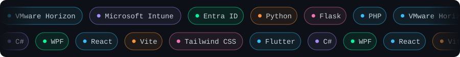
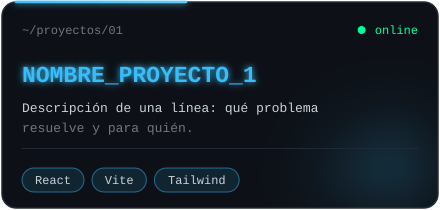
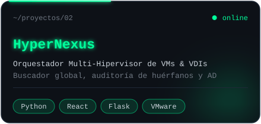
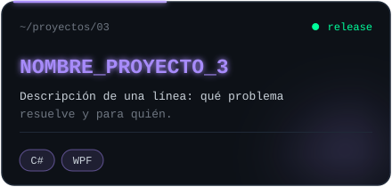
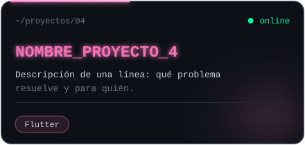

<div align="center">



<br/>


&nbsp;

&nbsp;

&nbsp;


</div>

<br/>

```console
usuario@portfolio:~$ cat about.txt

NOMBRE     : José D. Martone Aguais
ROL        : Full Stack Developer / IT Technical Support L2
ENFOQUE    : Opero la infraestructura y escribo el software que corre encima.
             Automatizo lo que otros hacen a mano.
UBICACIÓN  : Buenos Aires, CABA, Argentina
IDIOMAS    : Español (Nativo) · Inglés (Intermedio)
ESTADO     : Abierto a proyectos y colaboraciones técnicas

dev-jmartone@portfolio:~$ _
```

<br/>

<div align="center"></div>

<div align="center"></div>

<br/>

<div align="center"></div>

<div align="center"></div>

<br/>

<details open>
<summary><b>📂 infra/</b> &nbsp;<kbd>Infraestructura, VDI & Endpoint Management</kbd></summary>

<br/>

```console
$ ls -la ~/skills/infra/
drwxr-xr-x  vdi/         VMware vSphere · Horizon · App Volumes
drwxr-xr-x  endpoint/    Microsoft Intune · Wipes & App Deployment
drwxr-xr-x  identity/    Active Directory · Microsoft Purview · Windows Server
```

| Módulo | Tecnología | Ámbito de Aplicación |
|:--|:--|:--|
| `vdi` | **VMware Horizon & vSphere** | Escritorios virtuales, pools, Horizon (Omnissa Client), App Volumes (empaquetado y aprovisionamiento) |
| `endpoint` | **Microsoft Intune** | Políticas MDM/MAM, enrolamiento de flotas (macOS / Windows), gestión de wipes y despliegue masivo de apps |
| `identity` | **Active Directory & Purview** | Gobierno de acceso, gestión de identidades, directivas y migración de archivos `.pst` a carpetas Archive de Outlook |


</details>

<details>
<summary><b>📂 backend/</b> &nbsp;<kbd>Servidor, APIs y Automatización de Procesos</kbd></summary>

<br/>

```console
$ ls -la ~/skills/backend/
-rwxr-xr-x  python/      Python · Flask · APIs REST · Parsers JSON
-rwxr-xr-x  php/         PHP · Servicios Backend
-rwxr-xr-x  csharp/      C# (.NET)
-rwxr-xr-x  databases/   SQLite · PostgreSQL · MySQL
```

| Lenguaje / DB | Framework / Ámbito de Uso |
|:--|:--|
| **Python** | Flask: APIs REST, dashboards de inventario VDI, comparador de permisos de AD, parseadores y filtros de logs JSON de Intune |
| **PHP** | Desarrollo web backend, servicios del lado del servidor y consumo de APIs |
| **C#** | Lógica de aplicaciones de soporte, herramientas de diagnóstico y utilitarios .NET |
| **Bases de Datos** | SQLite, PostgreSQL (integración con Grafana/Zabbix) y MySQL |


</details>

<details>
<summary><b>📂 frontend/</b> &nbsp;<kbd>Interfaces Web & Componentes Reactivos</kbd></summary>

<br/>

```console
$ ls -la ~/skills/frontend/
drwxr-xr-x  react/       React + JavaScript (ES6+)
drwxr-xr-x  tooling/     Vite · HTML5 · CSS3
drwxr-xr-x  styling/     Tailwind CSS
```

| Tecnología | Uso |
|:--|:--|
| **React** | SPAs modulares, tableros interactivos y visualización reactiva de datos |
| **Vite** | Empaquetado rápido, servidor de desarrollo y compilación optimizada |
| **Tailwind CSS** | Interfaces responsive basadas en utilidades, layouts modernos y dark mode |
| **JavaScript (ES6+)** | Lógica frontend, consumo asíncrono de APIs y manipulaciones del DOM |


</details>

<details>
<summary><b>📂 desktop-mobile/</b> &nbsp;<kbd>Escritorio y Móvil</kbd></summary>

<br/>

```console
$ ls -la ~/skills/desktop-mobile/
-rwxr-xr-x  wpf/         C# · WPF
-rwxr-xr-x  flutter/     Flutter · Dart
```

| Plataforma | Tecnología | Uso |
|:--|:--|:--|
| **Windows Desktop** | C# · WPF | Aplicaciones de diagnóstico, soporte técnico en depósito y administración |
| **Móvil / Multiplataforma** | Flutter | Aplicaciones móviles híbridas para Android e iOS |


</details>

<details>
<summary><b>📂 tooling/</b> &nbsp;<kbd>DevOps, IA & Flujo de Trabajo</kbd></summary>

<br/>

```console
$ ls -la ~/skills/tooling/
-rwxr-xr-x  devops/      Git · Docker · WSL (Linux)
-rwxr-xr-x  ai-cli/      Claude Code · Antigravity CLI · Copilot Studio
-rwxr-xr-x  enterprise/  Grafana · Zabbix · Power Automate · WebCenter API
```

| Categoría | Herramientas |
|:--|:--|
| **Control de Versiones & Entornos** | Git, Docker, WSL, Bash / PowerShell |
| **Herramientas de IA & CLI** | Claude Code, Antigravity CLI, Microsoft Copilot Studio |
| **Monitoreo & Automatización Enterprise** | Grafana, Zabbix, Power Automate, integración con WebCenter API |


</details>

<br/>

<div align="center"></div>

<br/>

<table align="center">
  <tr>
    <td align="center" width="50%">
      <a href="https://github.com/dev-jmartone"></a><br/>
      <a href="https://github.com/dev-jmartone">{ } Repositorio</a>
    </td>
    <td align="center" width="50%">
      <a href="https://github.com/dev-jmartone"></a><br/>
      <a href="https://github.com/dev-jmartone">{ } Repositorio</a>
    </td>
  </tr>
  <tr>
    <td align="center" width="50%">
      <a href="https://github.com/dev-jmartone"></a><br/>
      <a href="https://github.com/dev-jmartone">{ } Repositorio</a>
    </td>
    <td align="center" width="50%">
      <a href="https://github.com/dev-jmartone"></a><br/>
      <a href="https://github.com/dev-jmartone">{ } Repositorio</a>
    </td>
  </tr>
</table>

<div align="center">

<sub>$ gh repo list dev-jmartone --limit 50 &nbsp;→&nbsp; <a href="https://github.com/dev-jmartone?tab=repositories">ver todos los repositorios</a></sub>

</div>

<br/>

<div align="center"></div>

<br/>

<div align="center">

<picture>
  <source media="(prefers-color-scheme: dark)" srcset="https://raw.githubusercontent.com/dev-jmartone/dev-jmartone/output/github-snake-dark.svg" />
  <source media="(prefers-color-scheme: light)" srcset="https://raw.githubusercontent.com/dev-jmartone/dev-jmartone/output/github-snake.svg" />
  
</picture>

<br/><br/>


&nbsp;


</div>

<br/>

<div align="center"></div>

<br/>

<div align="center">

<a href="https://www.linkedin.com/in/josemartone/"></a>
<a href="https://github.com/dev-jmartone"></a>
<a href="mailto:martone.jda@gmail.com"></a>

<br/><br/>



</div>
